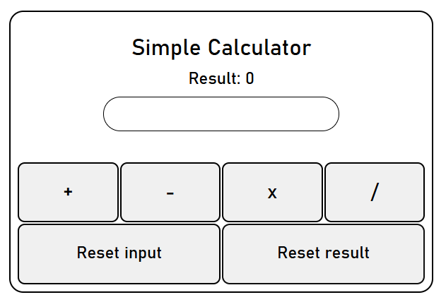

# React + Vite

This template provides a minimal setup to get React working in Vite with HMR and some ESLint rules.

# React Calculator

A simple calculator built with **React** that can perform basic arithmetic operations (add, subtract, multiply, divide) with reset options.

---



---

## 🚀 Features
- Addition, subtraction, multiplication, and division
- Reset input and reset result buttons
- Styled with CSS (flexbox & grid layout)
- Clean and minimal UI

## 🛠️ Installation & Setup

1. Clone this repository:
   ```bash
   git clone https://github.com/Dominionss/react-calculator.git
   cd react-calculator

2. Install dependencies:
   ```bash
   npm install

3. Start the development server:
   ```bash
   npm run dev

4. Open your browser at:
   http://localhost:5173

## ⚡ Technologies Used
    React (with Hooks)
    Vite
    CSS (Flexbox & Grid)
